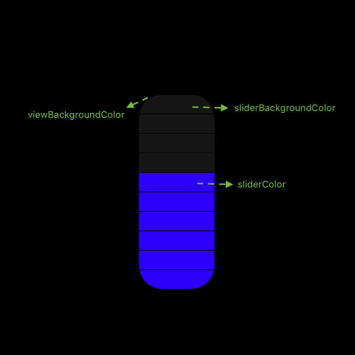

## SectionedSlider

| |	|
|:-:|:-:|
|  |  |

[](https://github.com/LeonardoCardoso/SectionedSlider#requirements-and-details)
[](https://github.com/LeonardoCardoso/SectionedSlider#cocoapods)
[](https://github.com/LeonardoCardoso/SectionedSlider#carthage)

> Control Center Slider

- [Requirements](#requirements)
- [Installation](#installation)
- [Usage](#usage)
- [License](#license)

## Requirements

- iOS 8.0+
- Swift 3.0+
- Xcode 8.0+

## Installation

### CocoaPods

[CocoaPods](http://cocoapods.org) is a dependency manager for Cocoa projects. You can install it with the following command:

```bash
$ gem install cocoapods
```

> CocoaPods 1.1.0+ is required to build SectionedSlider 0.0.3+.

To integrate SectionedSlider into your Xcode project using CocoaPods, specify it in your `Podfile`:

```ruby
source 'https://github.com/CocoaPods/Specs.git'
platform :ios, '8.0'
use_frameworks!

pod 'SectionedSlider', '~> 0.0.3'
```

Then, run the following command:

```bash
$ pod install
```

### Carthage

[Carthage](https://github.com/Carthage/Carthage) is a decentralized dependency manager that automates the process of adding frameworks to your Cocoa application.

You can install Carthage with [Homebrew](http://brew.sh/) using the following command:

```bash
$ brew update
$ brew install carthage
```

To integrate SectionedSlider into your Xcode project using Carthage, specify it in your `Cartfile`:

```ogdl
github "LeonardoCardoso/SectionedSlider" ~> 0.0.3
```

### Manually

If you prefer not to use either of the aforementioned dependency managers, you can integrate SectionedSlider into your project manually.

## Usage

You can use a `SectionedSlider` on [Storyboards](#storyboard) or, if you want to do it programatically, you can create it just like you create a UIView:

```swift
SectionedSlider(
    frame: CGRect(x: 0, y: 0, width: 78, height: 200), // Choose a 15.6 / 40 ration for width/height
    selectedSection: 3, // Initial selected section
    sections: 10 // Number of sections. Choose between 2 and 20
)
```

### Palette

You also can customize the colors of the button on its constructor.

```swift
SectionedSlider(
    frame: wrapView.frame,
    selectedSection: 3,
    sections: 10,
    palette: Palette(
        viewBackgroundColor: UIColor?,
        sliderBackgroundColor: UIColor?,
        sliderColor: UIColor?
    )
)
```



### Delegate

You can watch changes of state by implementing the protocol:

```swift
public protocol SectionedSliderDelegate {
    
	func sectionChanged(slider: SectionedSlider, selected: Int)
    
}
```

### Storyboard

Last but not least, you can customize `SectionedSlider` properties right from Interface Builder or Storyboards. 


## License

SectionedSlider is released under the MIT license. See [LICENSE](https://github.com/LeonardoCardoso/SectionedSlider/blob/master/LICENSE) for details.
